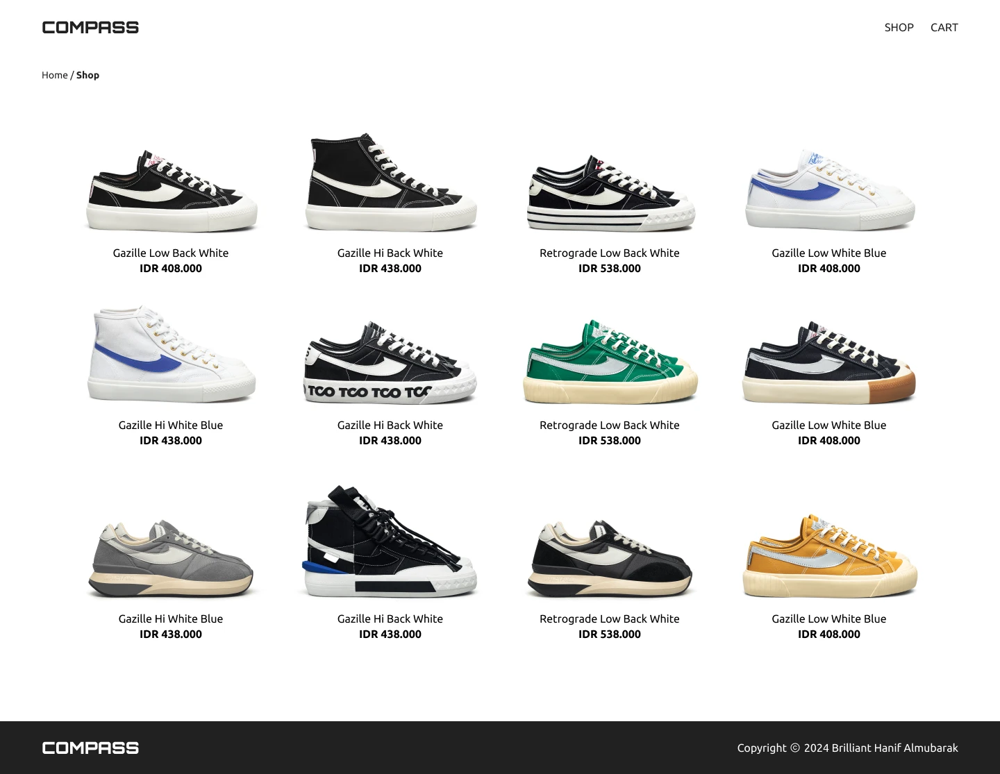
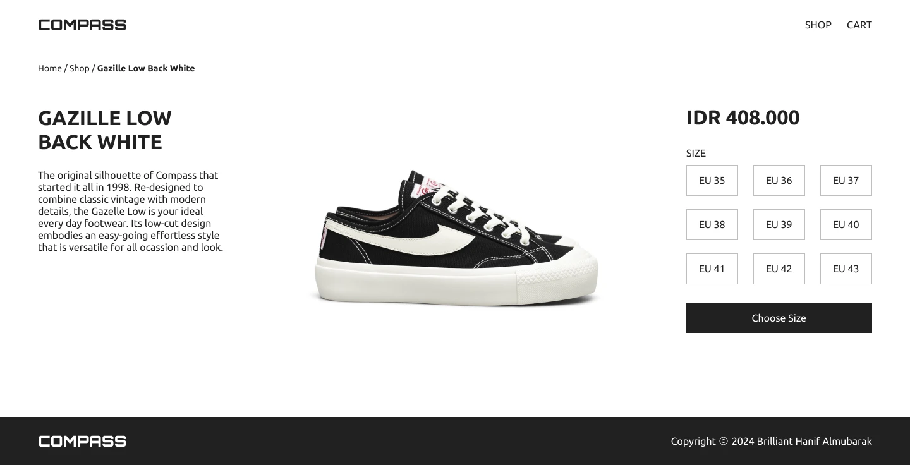
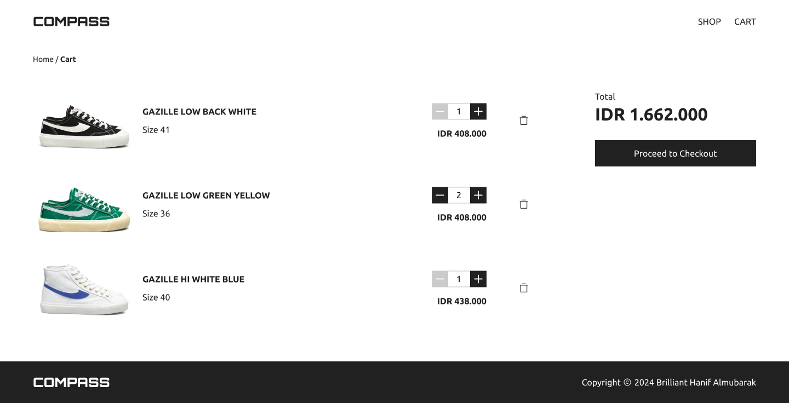
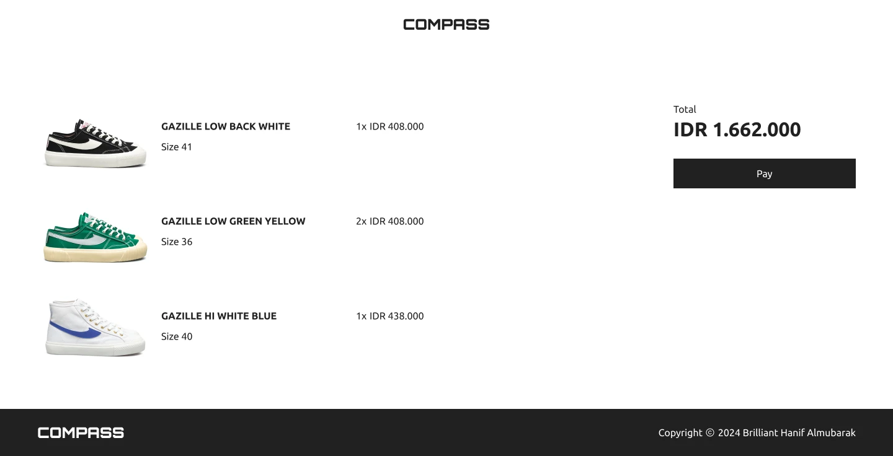
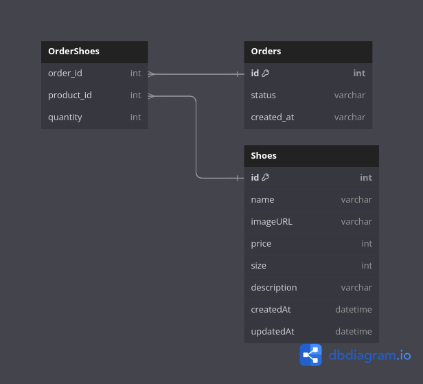

# Sepatu Compass

Online shop for Sepatu Compass

## Link:

Website : https://sepatucompass.hanifptw.com

github general : https://github.com/hanifptw/sepatucompass

github frontend : https://github.com/hanifptw/sepatucompass-frontend

github backend : https://github.com/hanifptw/sepatucompass-backend

## Inspirations:

https://sepatucompass.com/

## Features:

- Home page

  - Hero section
  - Tagline
  - Products catalogue/ Card shoes
  - footer

- Product

  - card product
    - image
    - price
    - name
  - categories filter

- Detail Product page

  - Image
  - SKU (stock keeping unit)
  - Name
  - Price
  - Description
  - size selection
  - add to cart button

- Shopping cart Page

  - Product items to buy
  - Image, name, price, quantity, size, total (price \* quantity)
  - Remove item
  - Close button
  - Link: checkout

- Checkout page
  - Order summary
    - Product items to buy
    - Grand total of all product items to buy
  - Place order / transaction is being processed

## UI Design

figma : https://www.figma.com/design/m7cbiLyWbwGtXil7GyWFaq/Sepatu-Compass

### Home Page

### Product Page

### Detail Page

### Cart Page

### Payment Page

## Entity Relationship Diagram(ERD)

